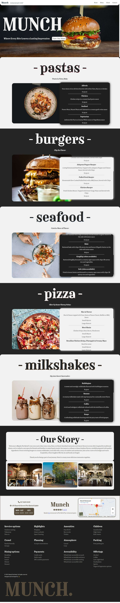

# Munch Restaurant

Welcome to Munch Restaurant! This is a personal project repository dedicated to creating a delightful dining experience.

## Description

Munch Restaurant is a local restauarant I love to dine at, This is fully function concept website for one of my favourite restaurants

## Getting Started

Website for local Restaurant, using React, To start your culinary journey with Munch Restaurant, follow these simple steps:

1. Clone this repository to your local machine:

   ``` git clone (https://github.com/AustinMaturure/munch/) ```

2. Navigate to the Munch Restaurant directory:

   ``` cd Munch ```

3. Install dependencies:

   ``` npm install ```

4. Start the development server:

   ``` npm run dev ```

## Screenshots



## Features

- Browse the Menu
- Interactive Map for Directions
- See all Services offered


## License

This project is licensed under the Austin License - see the non-exsitent file for details.
